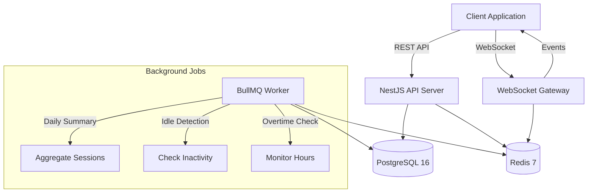
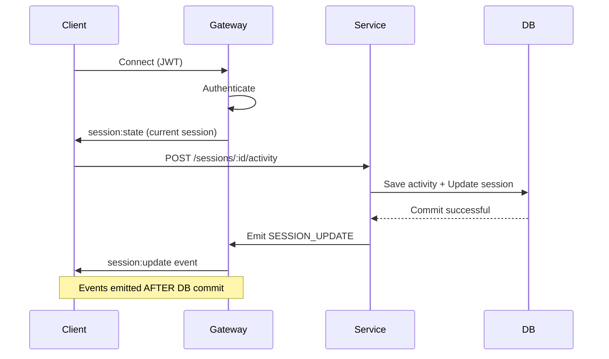

# WorkPulse Backend

Production-grade Workforce Productivity & Time Intelligence System built with NestJS, TypeORM, PostgreSQL, Redis, BullMQ, and Socket.IO.

## 🏗️ Architecture Overview



## ✨ Features

### Core Functionality
- **Multi-tenant Architecture**: Organization-based data isolation
- **Work Session Tracking**: Start/stop sessions with project association
- **High-frequency Activity Logging**: URL tracking with concurrency safety
- **Offline Bulk Upload**: Queue activities locally and sync on reconnection
- **Real-time Presence**: WebSocket-based user online/offline status
- **Productivity Reports**: Daily summaries with productivity scores
- **Smart Alerts**: Idle detection (5min) and overtime warnings (9hrs)

### Technical Highlights
- **Optimistic Locking**: Prevents race conditions during concurrent updates
- **Bulk Upload Deduplication**: Client-generated IDs ensure idempotency
- **Table Partitioning**: Monthly partitions for high-volume activity logs
- **Role-based Access**: Admin and employee roles with granular permissions
- **Graceful Shutdown**: Proper cleanup of connections and background jobs

## 🗄️ Database Schema

### Key Tables
- **organizations**: Multi-tenant organization data
- **users**: User accounts with role-based access (admin/employee)
- **projects**: Project management within organizations
- **work_sessions**: Session tracking with optimistic locking (`version` column)
- **activity_logs**: Partitioned table for high-volume activity data
- **daily_summaries**: Aggregated productivity metrics
- **alerts**: Idle and overtime notifications

### Optimistic Locking Strategy

WorkPulse uses TypeORM's `@VersionColumn()` on the `work_sessions` table to handle concurrent activity updates:

1. **Version Column**: Each session has a `version` field that increments on every update
2. **Retry Logic**: Failed updates due to version conflicts are automatically retried (3 attempts)
3. **No Double Counting**: Ensures accurate totals even with 100+ parallel requests

```typescript
// Simplified example
const session = await sessionRepository.findOne({ where: { id } });
session.total_active_seconds += 30;
await sessionRepository.save(session); // Throws error if version changed
```

## 🔌 WebSocket Event Flow



### WebSocket Events
- `user:online` - User starts session
- `user:offline` - User stops session
- `session:update` - Activity logged
- `alert:inactive` - Idle > 5 minutes
- `alert:overtime` - Work time > 9 hours

## 🔄 Background Jobs (BullMQ)

### 1. Daily Summary (Midnight)
- Aggregates all work sessions for the previous day
- Calculates productivity score: `(active_seconds / total_work_seconds) * 100`
- **Idempotent**: Uses upsert to prevent duplicate summaries

### 2. Idle Detection (Every 2 minutes)
- Finds sessions with `last_activity_at > 5 minutes ago`
- Creates alert and emits WebSocket event
- **Idempotent**: Checks for existing unresolved alerts

### 3. Overtime Checker (Every 30 minutes)
- Identifies sessions exceeding 9 hours total time
- Creates daily alert (one per user per day)
- **Idempotent**: Checks for existing alerts created today

All jobs have:
- 3 retry attempts with exponential backoff
- Auto-cleanup of completed jobs (24h retention)
- Failed job retention (7 days)

## 📊 Table Partitioning

The `activity_logs` table uses PostgreSQL native partitioning by month:

```sql
CREATE TABLE activity_logs (...) PARTITION BY RANGE (timestamp);

CREATE TABLE activity_logs_2024_02 PARTITION OF activity_logs
  FOR VALUES FROM ('2024-02-01') TO ('2024-03-01');
```

**Benefits**:
- Faster queries (partition pruning)
- Efficient archival (drop old partitions)
- Better index performance

**Maintenance**: Create new partitions monthly (can be automated)

## 🚀 Getting Started

### Prerequisites
- Node.js 18+
- Docker & Docker Compose

### Quick Start

1. **Clone and setup**:
```bash
git clone <repository>
cd work-pulse
cp .env.example .env
```

2. **Start services**:
```bash
docker-compose up --build
```

3. **Run migrations**:
```bash
docker exec -it workpulse-api npm run migration:run
```

4. **Verify health**:
```bash
curl http://localhost:3000/api/health
```

### Local Development

1. **Install dependencies**:
```bash
npm install
```

2. **Start PostgreSQL and Redis**:
```bash
docker-compose up postgres redis
```

3. **Run migrations**:
```bash
npm run migration:run
```

4. **Start development server**:
```bash
npm run start:dev
```

## 🧪 Load Testing

Test concurrency safety and bulk upload:

```bash
node test-activity-load.js
```

**What it tests**:
1. Registers user and starts session
2. Fires 100 parallel activity requests
3. Verifies totals match expected value (no double counting)
4. Tests bulk upload with duplicate detection
5. Confirms idempotency (re-uploading same batch)

**Expected output**:
```
✅ PASS: Totals match exactly! No double counting detected.
✅ PASS: Bulk upload is idempotent! All duplicates detected.
```

## 📡 API Endpoints

### Authentication
- `POST /api/auth/register` - Register new user/organization
  ```json
  {
    "email": "user@example.com",
    "password": "securePassword123",
    "name": "John Doe",
    "organization_name": "WorkPulse Corp",
    "plan_type": "pro"
  }
  ```
- `POST /api/auth/login` - Login and get JWT token
  ```json
  {
    "email": "user@example.com",
    "password": "securePassword123"
  }
  ```

### Sessions
- `POST /api/sessions/start` - Start work session
  ```json
  {
    "project_id": "uuid-of-project",
    "start_time": "2024-02-11T12:00:00Z"
  }
  ```
- `POST /api/sessions/:id/stop` - Stop session
  ```json
  {
    "end_time": "2024-02-11T18:00:00Z"
  }
  ```
- `GET /api/sessions/active` - Get active session

### Activity
- `POST /api/sessions/:id/activity` - Log single activity
  ```json
  {
    "activity_type": "active",
    "duration_seconds": 60,
    "url": "https://github.com/workpulse",
    "timestamp": "2026-02-12T12:05:00Z"
  }
  ```
- `POST /api/sessions/:id/activity/bulk` - Bulk upload (offline sync)
  ```json
  {
    "activities": [
      {
        "client_activity_id": "unique-client-uuid-1",
        "timestamp": "2026-02-12T12:05:00Z",
        "activity_type": "active",
        "duration_seconds": 60,
        "url": "https://github.com/workpulse"
      }
    ]
  }
  ```

### Projects
- `POST /api/projects` - Create project
  ```json
  {
    "name": "Backend Refactoring",
    "description": "Improving architecture and performance"
  }
  ```
- `GET /api/projects` - List projects

### Reports
- `GET /api/reports/daily?date=YYYY-MM-DD` - Daily summary
- `GET /api/reports/user/:id` - User report
- `GET /api/reports/organization` - Organization report (admin only)

### Health
- `GET /api/health` - System health check

## 🔐 Authentication

All endpoints (except `/auth/*` and `/health`) require JWT authentication:

```bash
curl -H "Authorization: Bearer <token>" http://localhost:3000/api/sessions/active
```

WebSocket connections also require JWT:
```javascript
const socket = io('http://localhost:3000', {
  auth: { token: '<jwt-token>' }
});
```

## 🛠️ Environment Variables

See `.env.example` for all configuration options:

- **Database**: `DB_HOST`, `DB_PORT`, `DB_USERNAME`, `DB_PASSWORD`, `DB_DATABASE`
- **Redis**: `REDIS_HOST`, `REDIS_PORT`, `REDIS_PASSWORD`
- **JWT**: `JWT_SECRET`, `JWT_EXPIRATION`
- **Thresholds**: `INACTIVE_THRESHOLD_SECONDS`, `IDLE_THRESHOLD_SECONDS`, `OVERTIME_THRESHOLD_HOURS`
- **Limits**: `MAX_BULK_ACTIVITIES`

## 📦 Project Structure

```
src/
├── common/              # Shared utilities
│   ├── decorators/      # Custom decorators
│   ├── filters/         # Exception filters
│   ├── guards/          # Auth guards
│   └── interceptors/    # Logging interceptors
├── config/              # Configuration files
├── database/
│   ├── entities/        # TypeORM entities
│   └── migrations/      # Database migrations
├── jobs/
│   └── processors/      # BullMQ job processors
├── modules/
│   ├── activity/        # Activity tracking
│   ├── auth/            # Authentication
│   ├── health/          # Health checks
│   ├── projects/        # Project management
│   ├── reports/         # Reporting
│   └── sessions/        # Session management
├── websocket/           # Socket.IO gateway
├── app.module.ts        # Root module
└── main.ts              # Application entry
```

## 🐳 Docker Services

- **api**: NestJS application server (port 3000)
- **worker**: Background job processor
- **postgres**: PostgreSQL 16 database (port 5432)
- **redis**: Redis 7 cache (port 6379)

## 🔧 Maintenance

### Creating New Migrations

```bash
npm run migration:generate -- src/database/migrations/MigrationName
```

### Reverting Migrations

```bash
npm run migration:revert
```

### Creating New Partitions

```sql
CREATE TABLE activity_logs_2024_03 PARTITION OF activity_logs
  FOR VALUES FROM ('2024-03-01') TO ('2024-04-01');
```

## 🤝 Contributing

1. Follow the existing code structure
2. Add tests for new features
3. Update documentation
4. Ensure migrations are reversible

## 📄 License

MIT

## 🙏 Acknowledgments

Built with:
- [NestJS](https://nestjs.com/) - Progressive Node.js framework
- [TypeORM](https://typeorm.io/) - ORM for TypeScript
- [BullMQ](https://docs.bullmq.io/) - Redis-based queue
- [Socket.IO](https://socket.io/) - Real-time engine
- [Pino](https://getpino.io/) - Fast JSON logger
